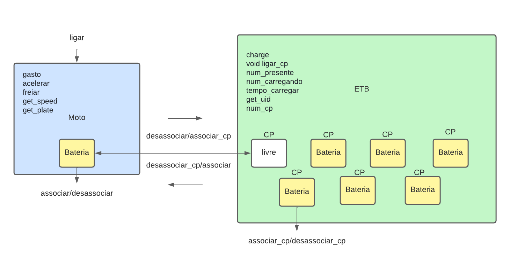

# Simulação de sistema de moto e abastecimento elétricos

## Introdução
Um motoboy inicia sua jornada com uma bateria cujo soc é de 85%. A moto é ligada, percorre um trajeto até uma ETB no período de 30 minutos (o tempo da simulação não precisa representar o tempo real). O motoboy pilota a moto da seguinte maneira:

- 6 ciclos de:
    - Acelera por 3 minutos
    - Freia por 10 segundos
- 4 ciclos de:
    - Acelera por 2  minutos
    - Freia por 12 segundos
- Acelera por 1 minuto e 40 segundos
- Freia por 32 segundos

No momento da saída do piloto, a ETB possui 6 baterias:

CP1: 100%
CP2: 100%
CP3: 100%
CP4: 70%
CP5: 60%
CP6: 50%
CP7: livre

No momento da troca, a bateria no CP nº 1, cujo soc é de 100%, é liberada para o piloto após a remoção da bateria em sua moto e inserção no CP livre da ETB. Considere que no momento que o piloto chega na ETB (timestamp 30 minutos) a bateria da moto é imediatamente inserida no CP livre e após 10 segundos a bateria do CP n°1 é imediatamente inserida na moto, que permanece parada até o fim da simulação.

## Ambiente de desenvolvimento
- Sistema Operacional: Windows 10
- IDE: CLion
- Versão da linguagem C++: C++17

## Funcionalidades

Temos as seguintes funcionalidades neste projeto (função/nomenclatura no projeto):

**API da moto**

- Ligar a moto / ligar
- Associar uma bateria / associar
- Liberar uma bateria / desassociar
- Acionar acelerador / acelerar
- Acionar freio / freiar
- Desligar a moto / ligar
- Acesso a todos os atributos (plate, speed, battery) / get_plate, get_speed, get_battery

**API da ETB**

- Associar uma bateria CP nº x / associar_cp
- Acionar carregamento CP nº x / ligar_cp
- Desligar carregamento CP nº x / ligar_cp
- Liberar bateria CP nº x / desassociar_cp
- Número de baterias presentes / num_presente
- Número de baterias carregando / num_carregando
- Tempo até final de carregamento bateria CP nº x / tempo
- Acesso a todos atributos (uid, cps) / get_uid, get_cps

**API da bateria**

- Associar host <moto ou ETB> / associar
- Desassociar host / desassociar
- Acesso a todos atributos (uid, soc, host) / get_uid, get_soc, get_host

